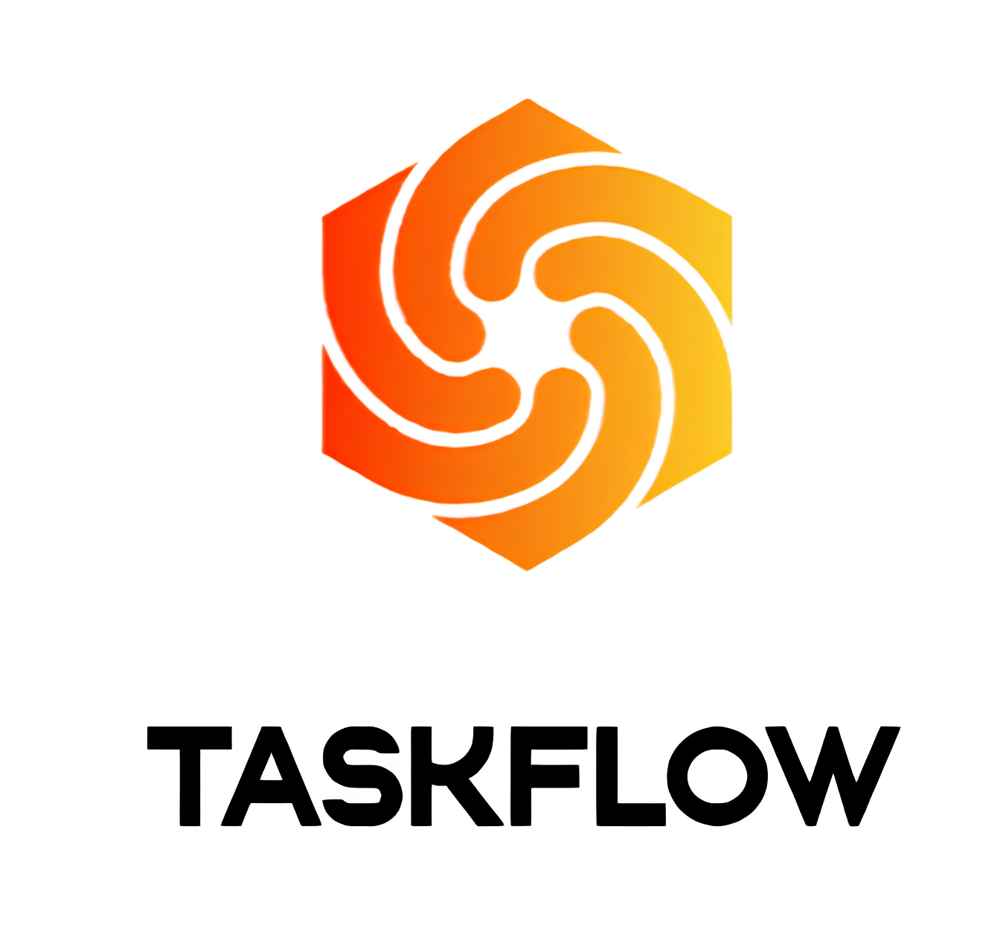

# TaskFlow: Kanban Project Management System

## Overview
TaskFlow is a Kanban-style project management system built using Flask. It allows teams to manage projects and tasks efficiently by providing a structured workflow, user roles, and task assignments. The system supports multiple user roles such as Executive, Manager, TeamLead, and Employee, each with different levels of access and permissions. Users can create and manage projects, teams, departments, and tasks, as well as track the progress of tasks through different stages (To Do, Doing, Done).



## Features
1. User Authentication and Authorization
2. Role-based Access Control
3. Project and Task Management
4. Team and Department Management
5. Task Assignments and Performance Tracking
6. Kanban Board Interface
7. Responsive Design

## File Structure
1. app.py: Main application file containing routes, models, and configurations.
2. created.py: Script for creating database tables.
3. create_role.py: Script for initializing user roles in the database.
4. templates/: Contains HTML templates for the web interface.
   1. index.html: Main dashboard page.
   2. login.html: User login page.
   3. register.html: User registration page.
5. static/css/styles.css: Custom CSS for styling the web interface.
6. kanban.db: SQLite database file containing the application data.

## Installation
1. Clone the repository:

```git clone https://github.com/maboychik/taskflow.git cd taskflow```

2. Create and activate a virtual environment:

```python -m venv venv source venv/bin/activate```  # On Windows use `venv\Scripts\activate`

3. Install the required dependencies:

```pip install -r requirements.txt```

4. Initialize the database:

```python created.py python create_role.py```

## Running the Application
1. Set the FLASK_APP environment variable:

```export FLASK_APP=app.py```  # On Windows use `set FLASK_APP=app.py`

2. Run the Flask application:

```flask run```

3. Access the application:
Open your web browser and navigate to http://127.0.0.1:5000.

## Usage
1. Register a new user:
    - Go to the registration page (http://127.0.0.1:5000/register) and create a new user account.
2. Login:
    - Login using the credentials created during registration (http://127.0.0.1:5000/login).
3. Dashboard:
    - Upon successful login, you will be redirected to the main dashboard where you can manage projects, tasks, teams, and departments.

## Contributing
Contributions are welcome! Please submit a pull request or create an issue to discuss new features or bugs.

## Acknowledgements
1. Flask Framework
2. Flask-Login for user session management
3. Flask-SQLAlchemy for database integration
